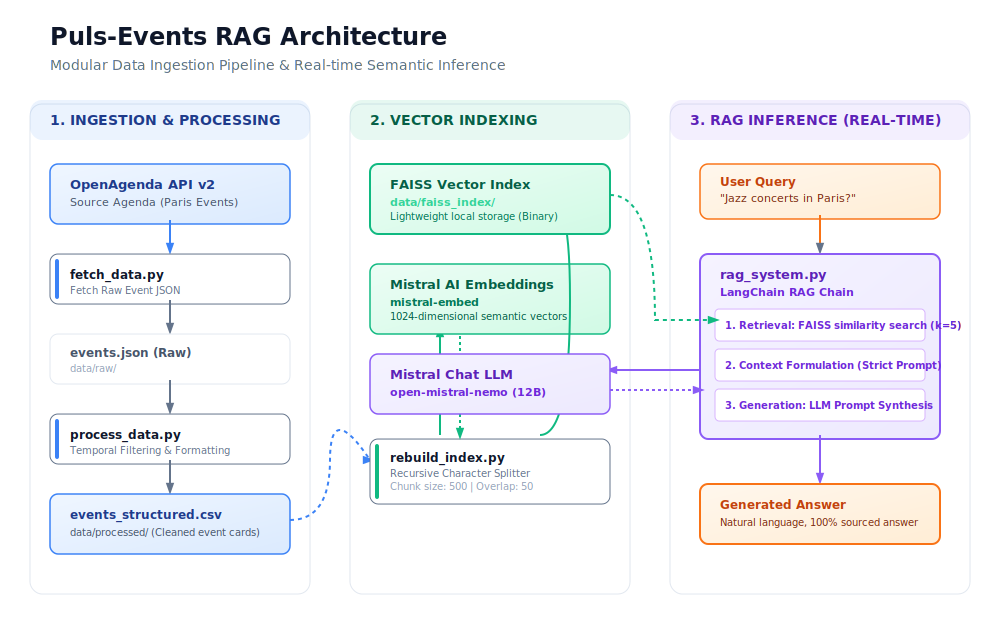

# Puls-Events RAG POC 🚀

This project is a Proof of Concept (POC) for an intelligent cultural assistant. It uses **RAG (Retrieval-Augmented Generation)** to recommend events from the Open Agenda platform based on semantic search and natural language synthesis.

Built for the **OpenClassrooms** AI Engineer path.

---

## 🖼️ System Architecture

Below is the modular data ingestion pipeline and real-time semantic inference architecture used in this system:



---

## 🛠️ Tech Stack

- **Language:** Python 3.10
- **Framework:** FastAPI (REST API)
- **Orchestration:** LangChain
- **LLM:** Mistral AI (Open Mistral Nemo)
- **Vector Database:** FAISS (Facebook AI Similarity Search)
- **Environment:** Poetry & Docker
- **Evaluation:** Ragas

---

## 📋 Prerequisites

- **Python 3.10+**
- **Poetry** (Dependency manager)
- **Docker** (for containerized deployment)
- **Mistral API Key** (Get one at [console.mistral.ai](https://console.mistral.ai/))

---

## 🚀 Getting Started

### 1. Clone & Setup
```bash
git clone <https://github.com/asmaaliouche/rag-system-deployment.git>
cd puls-events-rag-poc
cp .env.template .env
```
*Edit `.env` and add your `MISTRAL_API_KEY` and optional `OPENAGENDA_API_KEY`.*

### 2. Install Dependencies
```bash
poetry install
```

### 3. Initialize the Vector Index
Before running the system, you must fetch the data, process it, and build the FAISS index:
```bash
# 1. Fetch data from OpenAgenda API
poetry run python src/fetch_data.py

# 2. Clean and structure the raw events
poetry run python src/process_data.py

# 3. Build the FAISS vector index
poetry run python src/rebuild_index.py
```

---

## 🖥️ Usage

### Running Locally
```bash
poetry run uvicorn api.main:app --reload
```
The API will be available at `http://localhost:8000`.

### Running with Docker
```bash
# Build the image
docker build -t puls-events-rag .

# Run the container
docker run -p 8000:8000 --env-file .env puls-events-rag
```

---

## 📡 API Documentation (Swagger)

FastAPI automatically generates interactive documentation. Once the API is running, visit:
👉 **[http://localhost:8000/docs](http://localhost:8000/docs)**

### How to test the chatbot:
1. Locate the **`POST /ask`** endpoint.
2. Click **"Try it out"**.
3. In the Request Body, replace `"string"` with a full question:
   ```json
   {
     "question": "Quels sont les concerts de jazz prévus à Paris ?"
   }
   ```
4. Click **"Execute"** to see the AI's response.

---

## 📊 Evaluation & Testing

### Ragas Automated Evaluation
To measure the semantic quality of the RAG system (Faithfulness, Relevancy, Context Precision, and Recall) against our annotated golden dataset (`data/evaluation_set.json`):
```bash
poetry run python src/evaluate_rag.py
```
Results will be saved in `data/evaluation_results.csv`.

### Running Unit Tests
Execute the local unit test suite (covering processing and indexing logic) with:
```bash
poetry run pytest
```

### Running Functional API Tests
To run live functional tests against your running FastAPI server or Docker container:
```bash
# Ensure your API is running first (http://localhost:8000)
poetry run python tests/api_test.py
```

---

## 📂 Project Directory Structure

- `api/`: FastAPI web server.
  - `main.py`: Routes (`/ask`, `/rebuild`) and orchestrations.
- `data/`: Local database storage.
  - `raw/`: Raw event JSON downloaded from OpenAgenda.
  - `processed/`: Formatted event CSV files ready for indexing.
  - `faiss_index/`: Local binary FAISS vector files.
  - `evaluation_set.json`: Annotated human-curated reference test set.
- `docs/`: Technical reports and system diagrams.
  - `TECHNICAL_REPORT.md`: English business and technical validation report.
  - `architecture.svg`: Vector diagram of the RAG system design.
- `src/`: Core Python module logic.
  - `fetch_data.py`: Ingestion logic from OpenAgenda API.
  - `process_data.py`: Data cleaning, formatting, and filtering.
  - `rebuild_index.py`: Document splitter and FAISS builder.
  - `rag_system.py`: LangChain RAG pipeline configuration.
  - `evaluate_rag.py`: Ragas test execution and scoring script.
- `tests/`: Testing directory.
  - `test_data.py`, `test_indexing.py`, `test_rag.py`: Unit tests.
  - `api_test.py`: Standalone live API endpoint validator.
- `Dockerfile`: Container configuration.
- `pyproject.toml` / `poetry.lock`: Poetry project configuration and dependency graph.
- `README.md`: Project manual (this file).
